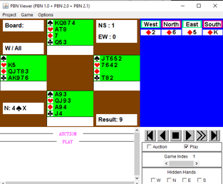

# xin2pbn

xinrui bridge online url to pbn converter

xinrui url like [this](https://isoliu.gitlab.io/deallog/DealLog.html?bidlog=1D,1S,P;2D,3C,P,P;4S,P,P,X;P,P,P&playlog=E:5D,KD,2D,6D;S:3H,5H,8H,7H;N:8S,TS,AS,3D;S:4C,KC,3C,2C;W:8D,7D,2S,9D;E:8C,JC,AC,5C;W:QD,TH,5S,4D;E:6H,9H,KH,AH;N:&deal=.K5.QJT832.AK976%20KQ874.AT8.76.Q53%20JT652.7642.5.T82%20A93.QJ93.AK94.J4&vul=All&dealer=W&contract=4SX&declarer=N&wintrick=9&score=-200&str=%E9%94%A6%E6%A0%87%E8%B5%9B%20%E7%AC%AC12%E8%BD%AE%20%E7%89%8C%E5%8F%B7%204/12&dealid=653117488&pbnid=127397878), it can be converted to standard pbn files [output.pbn](output.pbn)

# Usage

````
pip install xin2pbn
xin2pbn "url"
xin2pbn "local.html"
````

## example

````
$ xin2pbn "https://isoliu.gitlab.io/deallog/DealLog.html?bidlog=1D,1S,P;2D,3C,P,P;4S,P,P,X;P,P,P&playlog=E:5D,KD,2D,6D;S:3H,5H,8H,7H;N:8S,TS,AS,3D;S:4C,KC,3C,2C;W:8D,7D,2S,9D;E:8C,JC,AC,5C;W:QD,TH,5S,4D;E:6H,9H,KH,AH;N:&deal=.K5.QJT832.AK976%20KQ874.AT8.76.Q53%20JT652.7642.5.T82%20A93.QJ93.AK94.J4&vul=All&dealer=W&contract=4SX&declarer=N&wintrick=9&score=-200&str=%E9%94%A6%E6%A0%87%E8%B5%9B%20%E7%AC%AC12%E8%BD%AE%20%E7%89%8C%E5%8F%B7%204/12&dealid=653117488&pbnid=127397878"
write to file output.pbn

$ curl -O https://isoliu.gitlab.io/book2020/web/1-chapter2-B01-zdjs.html
  % Total    % Received % Xferd  Average Speed   Time    Time     Time  Current
                                 Dload  Upload   Total   Spent    Left  Speed
100  5054  100  5054    0     0  11512      0 --:--:-- --:--:-- --:--:-- 11512
$ xin2pbn 1-chapter2-B01-zdjs.html
[b'https://isoliu.gitlab.io/deallog/DealLog.html?bidlog=1D,1S,P;2D,3C,P,P;4S,P,P,X;P,P,P&amp;playlog=E:5D,KD,2D,6D;S:3H,5H,8H,7H;N:8S,TS,AS,3D;S:4C,KC,3C,2C;W:8D,7D,2S,9D;E:8C,JC,AC,5C;W:QD,TH,5S,4D;E:6H,9H,KH,AH;N:&amp;deal=.K5.QJT832.AK976%20KQ874.AT8.76.Q53%20JT652.7642.5.T82%20A93.QJ93.AK94.J4&amp;vul=All&amp;dealer=W&amp;contract=4SX&amp;declarer=N&amp;wintrick=9&amp;score=-200&amp;str=%E9%94%A6%E6%A0%87%E8%B5%9B%20%E7%AC%AC12%E8%BD%AE%20%E7%89%8C%E5%8F%B7%204/12&amp;dealid=653117488&amp;pbnid=127397878', b'https://isoliu.gitlab.io/deallog/DealLog.html?bidlog=1D,1S,P;2D,3C,P,P;4S,P,P,X;P,P,P&amp;playlog=E:5D,AD,2D,6D;S:QH,KH,AH,7H;N:KS,2S,3S,3D;N:4S,TS,AS,8D;S:3H,5H,8H,2H;N:TH,6H,JH,7C;S:9H,6C,7D,4H;S:4C,KC,3C,2C;W:AC,5C,8C,JC;W:QD,QS,TC,4D;N:&amp;deal=.K5.QJT832.AK976%20KQ874.AT8.76.Q53%20JT652.7642.5.T82%20A93.QJ93.AK94.J4&amp;vul=All&amp;dealer=W&amp;contract=4SX&amp;declarer=N&amp;wintrick=10&amp;score=790&amp;str=%E9%94%A6%E6%A0%87%E8%B5%9B%20%E7%AC%AC12%E8%BD%AE%20%E7%89%8C%E5%8F%B7%204/12&amp;dealid=653247876&amp;pbnid=127397878']
write to file ./1-chapter2-B01-zdjs-01.pbn
write to file ./1-chapter2-B01-zdjs-02.pbn

$ cat 1-cha*.pbn > all.pbn
````

## snapshot

original source in xinrui UI


The outputed pbn can be viewed inside bridgecomposer & pbnjview




# Development

````
# docker run -it  -v $PWD:/app  -w /app python:3.8  bash
# python3 -m pip install --user --upgrade twine
# python3 setup.py sdist clean
# python3 setup.py sdist bdist_wheel
# python3 -m twine upload --skip-existing --verbose dist/*
````

## TODO

* Web interface
* convert to js to be used by anyone

# Reference

* http://www.tistis.nl/pbn/
* http://xinruibridge.com/
* http://bridgecomposer.com/